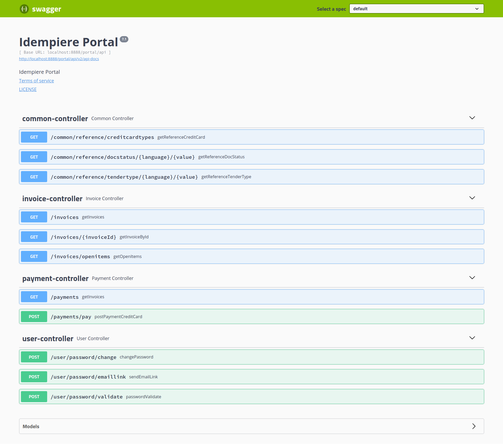

# &int; created
> Integration created

# Idempiere Portal API
> 

This server side plugin works in pair with frontend PrimeNG-Angular plugin that can be found here 
[https://github.com/icreated/portal-frontend](https://github.com/icreated/portal-frontend) 

This plugin is fully dependent on Spring Framework and integrates its features:

*   Spring configuration with @Configuration annotation
*	Idempiere context injected by application.properties
*	Simple architecture with @Autowire annotation 
*   JdbcTemplate used over native DB Idempiere static database connection
 

From a functional point of view this plugin provides following features:

*	JWT Spring Security authentication
*	Swagger Integration for JSON based Frontend Integration and API testing
*	Invoices and Payments lists
*	OpenItems, i.e. payment due under contract
*	Payment Imitation by Credit Card


## Installing / Getting started

To build this plugin you need to get sources in your project directory:

```shell
git clone https://github.com/icreated/portal-api.git
```
**Important!**
Edit pom.xml to link native Idempiere libraries with parent project.
If you put sources directly in Idempiere sources folder, it will be

```xml
<relativePath>../org.idempiere.parent/pom.xml</relativePath>
```
like others Idempiere plugins, otherwise modify it.

Be sure to satisfy all required dependencies. All needed jars are added directly to lib folder.


### Deploying / Publishing / Testing
Check if it works by accessing to Swagger Home Page:
[http://localhost:8080/portal/api/swagger-ui.html](http://localhost:8080/portal/api/swagger-ui.html) 
To connect to API you have to provide AD_User Value and Password. For example: gardenusr / GardenUser

 


## Contributing

If you'd like to contribute, please fork the repository and use a feature
branch. 

Pull requests are warmly welcome


## Licensing

GNU General Public License
